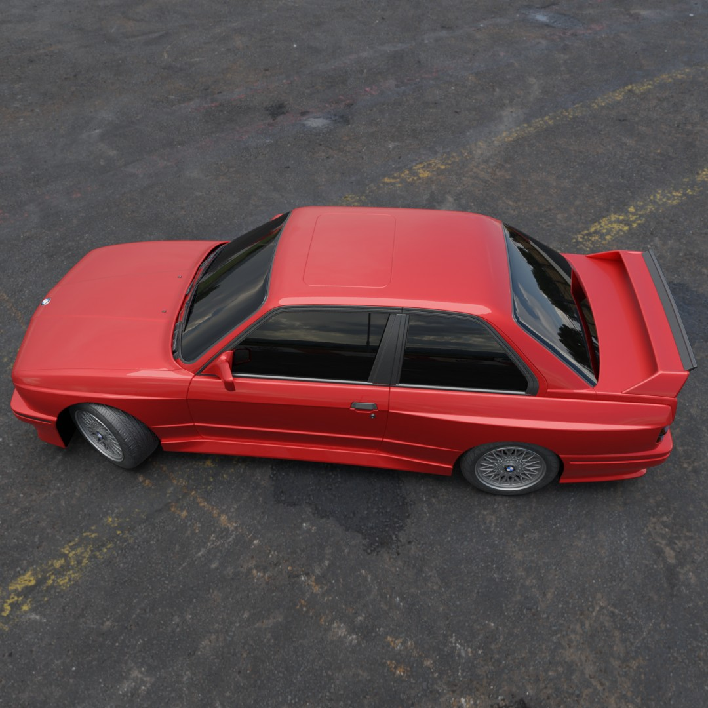
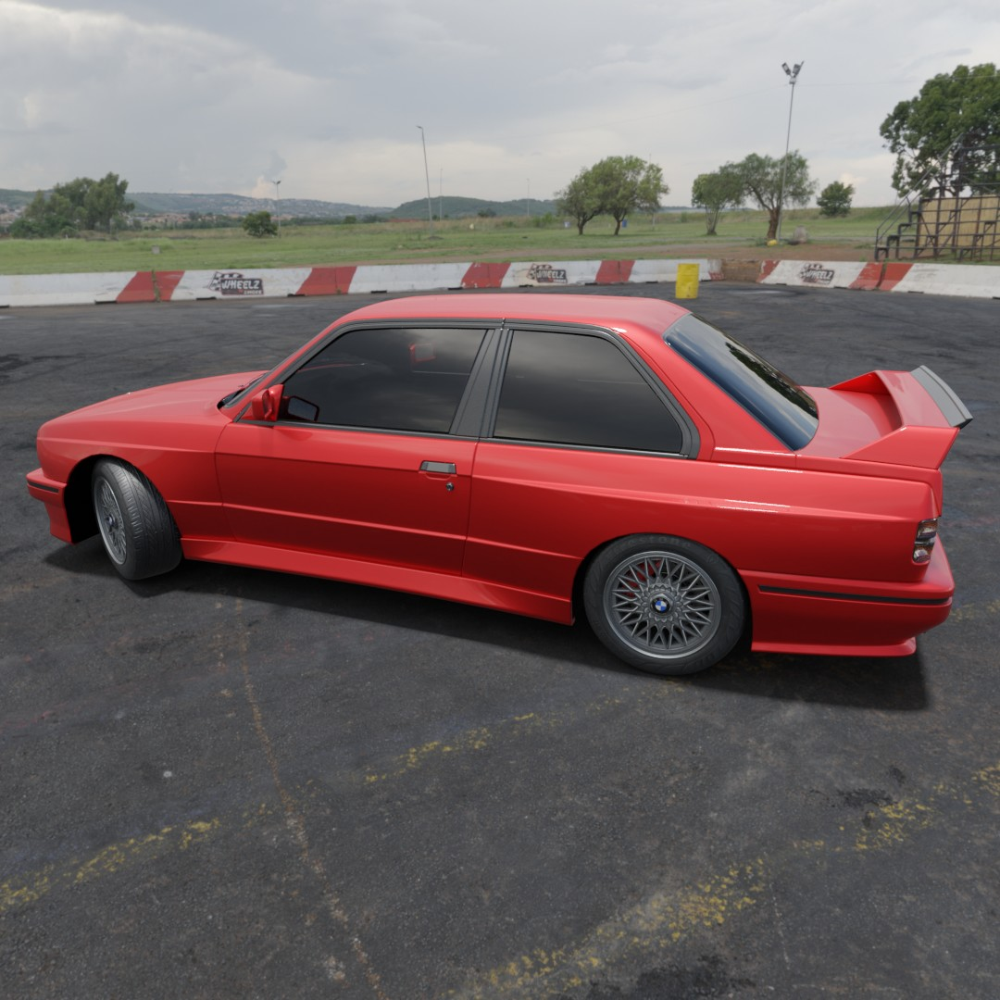
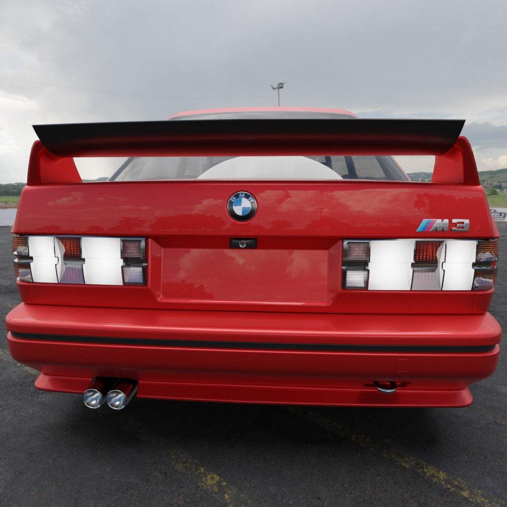
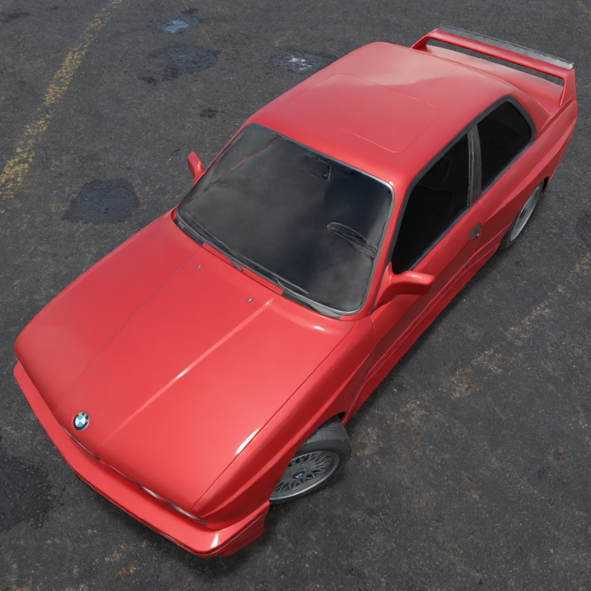
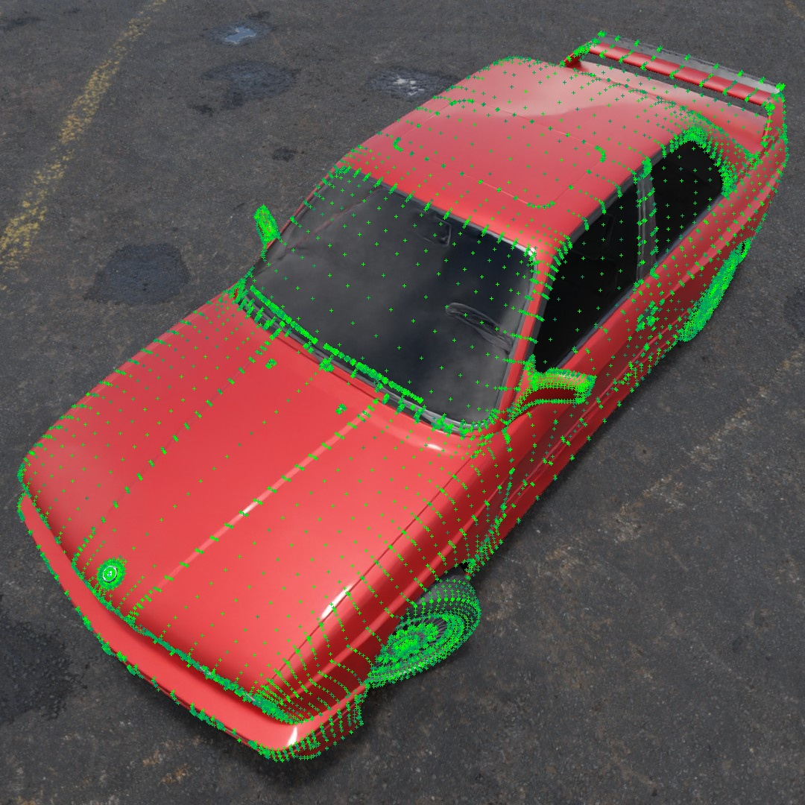

# Car dataset generator

## Description

This script generates a dataset of cars in different positions and with different lighting. The model is always whole captured by the camera.

Add your own models and hdri maps to `models` and `hdri` directories respectively.

## Anotations

Each vertex of the model is annotated with pixel position in output image and if the vertex is visible in the image.

### How to run

```bash
blender -b -P ./main.py
```

## Examples

Examples can be found in `dataset` directory.

<!-- 

 -->

<div style="display: flex; flex-direction: row; justify-content: space-between">
 
 
</div>

<br>
<div style="display: flex; flex-direction: row; justify-content: space-between">
 
 
 
</div>
